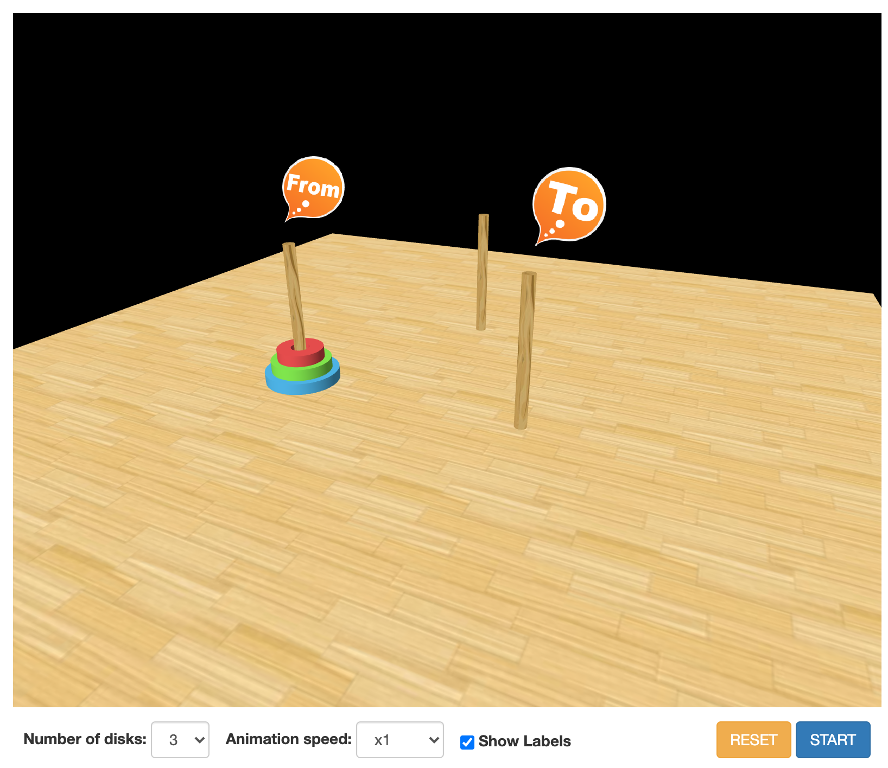

# Simple Hanoi tower puzzle animation

See it running [here](http://blog.marcinchwedczuk.pl/assets/apps/hanoi/index.html).




### Building

NodeJS 16.x and Gulp are required to build this application
(Gulp is quite slow to add support for newer NodeJS versions, 
so please make sure that you use exactly 16.x):
```
$ node --version
v16.0.0

$ npm --version
7.10.0
```

It is recommended to install NodeJS via [nvm](https://github.com/nvm-sh/nvm):
```
$ nvm install 16.0.0
$ nvm use 16.0.0
$ node --version 
v16.0.0
```

Install Gulp if you don't have it installed yet:
```
$ npm install --global gulp-cli
$ gulp --version
CLI version: 2.3.0
```

Install Bower:
```
$ npm install -g bower
$ bower --version
1.8.12
```

Build and start the game:
```
$ npm install
$ bower install
$ gulp clean serveDist
```
Enjoy! :tada:

